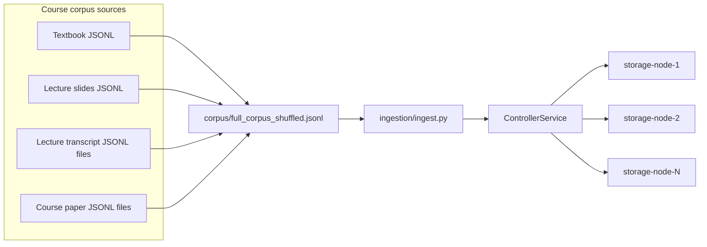
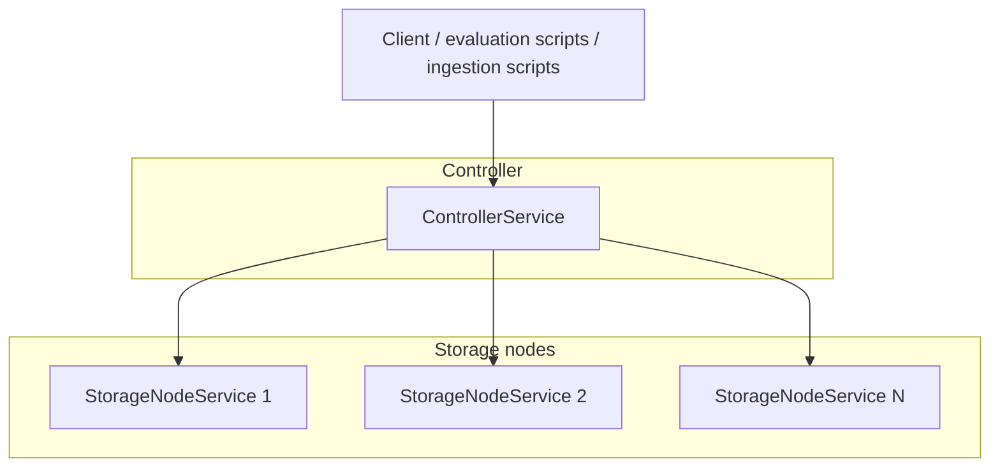
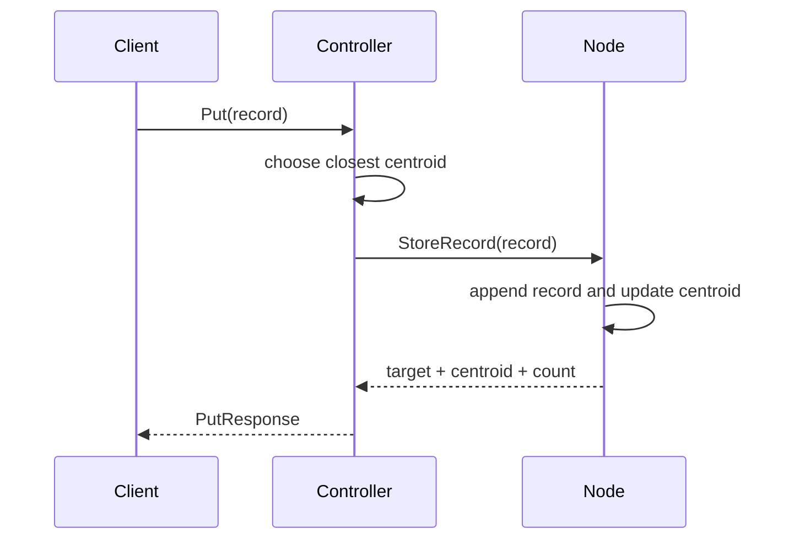
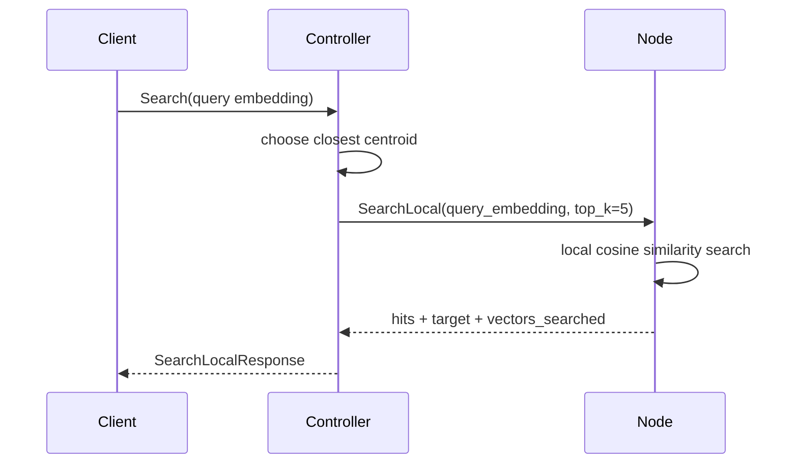
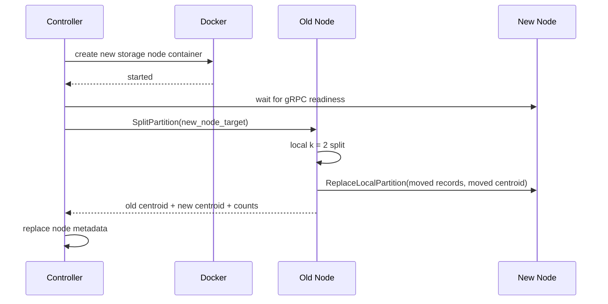

# Project 2: Distributed Semantic KV Store with Dynamic Repartitioning

**Course:** CSCI 5105 - Introduction to Distributed Systems  
**Semester:** Spring 2026  
**Instructor:** Jon Weissman  
**Released:** 03/24/2026
**Due:** 04/06/2026

## 1. Overview

In Project 1, you built a single-node gRPC key-value store for semantic retrieval. In Project 2, you will extend that idea into a distributed semantic store with one controller and a growing set of storage nodes.

Each `Record` already includes an embedding vector. The distributed system does **not** generate embeddings during `Put`. Instead:

- `Put` receives a pre-vectorized `Record`
- `Search` receives a pre-vectorized query embedding
- the controller routes both requests using centroid similarity
- each storage node stores only its local partition of records

When a node grows too large, the controller creates a new storage node container and asks the overloaded node to repartition itself. The overloaded node runs a simple local `k = 2` split, keeps one cluster locally, and moves the other cluster to the new node.

This project gives you a concrete distributed systems setting for thinking about:

- request routing
- online scale-out
- semantic partitioning
- approximate search versus full search
- the tradeoff between search quality and search cost

## 2. Data Flow and Corpus Organization

The course corpus is built from several sources and then merged into one larger JSONL file that is ingested into the distributed store.



The repository already contains both the source corpora and a combined shuffled corpus:

- `corpus/textbook/...`
- `corpus/lecture_slides/...`
- `corpus/lecture_transcripts/...`
- `corpus/course_papers/...`
- `corpus/full_corpus_shuffled.jsonl`

The shuffled full corpus is useful because insertion order matters in this project. You will analyze that explicitly in the deliverables section.

## 3. Core Partitioning Idea

Each storage node maintains:

- its own local records
- its local centroid
- simple local search over only its own partition

The controller maintains:

- the target for each storage node, such as `storage-node-2:50051`
- the centroid for each node
- the total number of vectors inserted so far

At a high level, the controller never searches the full corpus. Instead, it compares a query embedding to the node centroids and forwards the search to the single closest node.

This makes search cheaper, but it also makes search approximate. If the partitioning is poor, or if the current query belongs near a partition boundary, routed search may miss high-quality records that live on another node.

## 4. High-Level Architecture



The controller is responsible for orchestration. Storage nodes are responsible for local storage, local search, and local repartitioning.

## 5. RPC Summary

### ControllerService

- `Put(PutRequest) returns (PutResponse)`
- `Search(SearchRequest) returns (SearchLocalResponse)`
- `ClusterStatus(ClusterStatusRequest) returns (ClusterStatusResponse)`

### StorageNodeService

- `StoreRecord(StoreRecordRequest) returns (StoreRecordResponse)`
- `SearchLocal(SearchLocalRequest) returns (SearchLocalResponse)`
- `ReplaceLocalPartition(ReplaceLocalPartitionRequest) returns (ReplaceLocalPartitionResponse)`
- `SplitPartition(SplitPartitionRequest) returns (SplitPartitionResponse)`
- `GetNodeStats(GetNodeStatsRequest) returns (NodeStats)`

A small but important detail is that controller-side `Search` currently returns the same `SearchLocalResponse` message shape that a storage node returns. In other words, the controller is forwarding a search to a single node and returning that node's answer.

## 6. Put Path

1. A client sends a pre-vectorized `Record` to the controller.
2. The controller compares the record embedding against the current node centroids.
3. The controller forwards the record to the closest node with `StoreRecord`.
4. The storage node stores the record, recomputes its centroid, and returns the updated count.
5. If that count exceeds the repartition threshold, the controller starts a background split.



## 7. Search Path

1. A client sends a precomputed query embedding to the controller.
2. The controller compares the query embedding against the node centroids.
3. The controller forwards the search to the closest node.
4. The chosen storage node searches only its local records and returns the top `k` local hits.



This is the central tradeoff in the project:

- searching fewer vectors is cheaper
- searching only one partition may reduce result quality

## 8. Repartitioning and Scale-Up

The controller uses a hardcoded split threshold in `controller/controller.py`:

```python
MAX_VECTORS_PER_NODE = 1000
```

When a node exceeds that size, the controller creates a new container and instructs the overloaded node to split itself.




A key design choice here is that the controller orchestrates, but the overloaded node performs the actual split.

## 9. Why Insertion Order Matters

In this project, insertion order affects the resulting partition layout.

Why?

- centroids are updated incrementally as records arrive
- early routing decisions influence which records coexist on the same node
- once a node splits, future records are routed using the new centroids
- a different insertion order can produce different local clusters and different future splits

So even with the same final corpus, two different `Put` orders can produce different partitions, different local centroids, different search costs, and different search quality.

You will analyze this directly in the deliverables section.

## 10. Repository Layout

```text
.
├── controller/
│   └── controller.py
├── storage_node/
│   └── node.py
├── proto/
│   ├── project2.proto
│   ├── gen_proto.sh
│   └── src/
├── utils/
│   ├── config.py
│   └── utils.py
├── ingestion/
│   └── ingest.py
├── evaluation/
│   ├── evaluate.py
│   └── cluster_status.py
├── question_set/
│   ├── questions_scored.jsonl
│   └── pretty_print_question.py
├── corpus/
│   ├── course_papers/
│   ├── lecture_slides/
│   ├── lecture_transcripts/
│   ├── textbook/
│   ├── full_corpus_shuffled.jsonl
│   └── mini_corpus.jsonl
├── docker/
│   ├── Dockerfile
│   └── docker-compose.yml
└── requirements.txt
```

## 11. Configuration Notes

The main shared runtime constants are hardcoded in `utils/config.py`:

- `CONTROLLER_HOST`
- `CONTROLLER_PORT`
- `CONTROLLER_TARGET`
- `NODE_PORT`
- `DOCKER_IMAGE`
- `DOCKER_NETWORK`

Each storage node's `NODE_TARGET` still comes from container environment, since each container needs its own identity such as `storage-node-1:50051` or `storage-node-4:50051`.

## 12. Running the System

### Start the system

From the `docker/` folder, run:

```bash
docker compose up --build -d
```

### Shut the system down and clean up all storage-node containers

From the `docker/` folder, run:

```bash
docker compose down;docker rm -f $(docker ps -aq --filter "name=storage-node")
```

The extra `docker rm` is useful because repartitioning can create additional storage-node containers during testing.

### Recommended workflow

1. Start the services from the **host machine** in the `docker/` folder.
	1. Don't attempt to run the container service from the .devcontainer
2. Open the repository in the devcontainer.
3. Run ingestion and evaluation scripts from the repository root inside the devcontainer.

Typical commands from the repository root inside the devcontainer:

```bash
python ingestion/ingest.py
python evaluation/cluster_status.py
python evaluation/evaluate.py
```

## 13. Student Implementation Requirements

You are responsible for implementing the following RPC logic.

### In `controller/controller.py`

Implement:

- `Put(...)`
- `Search(...)`

At a high level:

- `Put` should route the incoming pre-vectorized `Record` to the closest storage node by centroid similarity
- `Put` should update the controller's node metadata after the insert returns
- `Put` should trigger repartitioning when a node exceeds the configured split threshold
- `Search` should route the query embedding to the closest storage node and return that node's local search result

### In `storage_node/node.py`

Implement:

- `StoreRecord(...)`
- `SearchLocal(...)`
- `SplitPartition(...)`

At a high level:

- `StoreRecord` should append the new record, recompute the local centroid, and return the updated local count
- `SearchLocal` should run local top-`k` cosine similarity search over the records stored on that node
- `SplitPartition` should divide an overloaded node into two partitions, move one partition to the new node, and return the updated metadata for both sides

### What is intentionally provided

The project scaffolding, Docker setup, protobuf definitions, corpus files, and helper utilities are intentionally provided so that you can focus on routing, local search, and repartitioning behavior.

## 13. What the Provided Scripts Currently Do

### `ingestion/ingest.py`

The ingestion script currently inserts the full shuffled corpus one record at a time using repeated `Put` RPCs.

### `evaluation/cluster_status.py`

This script asks the controller for the current cluster status and prints, for each node:

- node target
- number of vectors stored
- mean cosine score of vectors against that node's centroid
- score standard deviation

### `evaluation/evaluate.py`

This script currently samples **one** question from `question_set/questions_scored.jsonl`, sends its query embedding to the controller, and compares the returned results against the oracle top-5 list stored in the question file.

This sample script is only a starting point. For the deliverables below, you should extend the evaluation logic to run across **all** questions, not just one random question.

### `evaluation/score_all_questions.py`

This script is the normalized scoring script for full-system evaluation.

At a high level, it:

1. ingests the full corpus from `corpus/full_corpus_shuffled.jsonl`
2. runs **all** scored questions in `question_set/questions_scored.jsonl`
3. computes a per-question normalized score
4. reports a final total score across the full question set

It uses the following definitions:

- `oracle_mean_score(q)` = mean of the oracle top-5 scores from `questions_scored.jsonl`
- `returned_mean_score(q)` = mean of the scores returned by your system
- `score_accuracy(q)` = `min(1.0, returned_mean_score(q) / oracle_mean_score(q))`
- `search_fraction(q)` = `vectors_searched(q) / total_vectors_in_corpus`
- `efficiency_score(q)` = `score_accuracy(q) / search_fraction(q)`

The final total score is:

`overall_score = average of efficiency_score(q) over all questions`

## 14. Required Analysis Deliverables

Your report should include a clear experimental analysis of the tradeoff between search quality and search cost.

### Deliverable A: Accuracy versus vectors searched as repartition size changes

Vary the repartition threshold used to trigger a split. In the provided controller, this is the `MAX_VECTORS_PER_NODE` value.

For multiple threshold values of your choice, evaluate the system across **all** questions in `question_set/questions_scored.jsonl`.

At a minimum, report:

- average number of vectors searched per question
- average searched fraction, defined as `vectors_searched / total_vectors_in_corpus`
- average returned score for the top results
- average oracle score from the scored question file
- a comparison or plot showing how search quality changes as the split threshold changes

The point of this analysis is to study the tradeoff:

- smaller threshold usually means more partitions and fewer vectors searched
- but more partitions may also hurt result quality if routing becomes less accurate

### Deliverable B: Does insertion order matter?

Yes, it does, and you should demonstrate and explain why.

Run at least two different ingestion orders for the same corpus. One should be the provided shuffled full corpus. The other should be a different order of your choice, such as:

- original unshuffled source order
- grouped by source type
- grouped by lecture date
- any other deterministic ordering you want to test

Answer questions such as:

1. Does the final partition layout change?
2. Does the average number of vectors searched change?
3. Does the returned search quality change?
4. Why do those differences happen in this system?

Your explanation should connect the observed behavior back to incremental centroid updates and split timing.

### Deliverable C: Propose a better repartitioning scheme

Propose an alternative repartitioning scheme whose goal is to:

- minimize the number of vectors searched
- preserve or improve the returned search quality

For the base project, you do **not** have to implement the alternative scheme. But you must describe it clearly.

Your proposal should explain:

- what metadata the controller and nodes would need
- how routing would work
- how repartitioning would work
- why you expect it to improve the accuracy versus search-cost tradeoff
- what new complexity or overhead your approach introduces

Examples of ideas you might consider:

- balanced split heuristics
- periodic global reclustering
- multi-probe search over more than one node
- overlapping partitions
- routing to the closest two centroids instead of one
- repartitioning that explicitly optimizes for both compactness and balance

### Deliverable D: Extend the evaluation beyond the sample script

The provided `evaluation/evaluate.py` evaluates only one random question.

You should extend your evaluation so that it runs across **all** questions in `question_set/questions_scored.jsonl` and reports aggregate metrics for the full question set.

## 15. Extra Credit Challenge

Groups that implement an alternative repartitioning scheme and demonstrate that it improves the system can receive extra credit.

To receive extra credit, a group should:

- implement an alternative scheme
- explain the design clearly
- evaluate it against the baseline implementation
- show evidence that it improves the quality versus search-cost tradeoff

## 16. Extra Credit for Alternative Repartitioning

All groups that implement an alternative repartitioning strategy and evaluate it against the baseline can receive extra credit.

To receive extra credit, a group should:

- implement an alternative scheme
- explain the design clearly
- evaluate it against the baseline implementation
- show evidence that it improves the quality versus search-cost tradeoff

The easiest way to make this comparison reproducible is to use `evaluation/score_all_questions.py` for both the baseline and your modified strategy.

## 17. Simplifying Assumptions

For this project, assume:

1. no scale down is required
2. data is append-only
3. all record embeddings and query embeddings are already provided
4. controller-side search routes to one node only
5. approximate routed search may miss records that a full search would find
6. fault tolerance is not the focus of this project

## 18. Suggested Questions to Discuss in Your Writeup

Your report will be stronger if it explicitly addresses questions like these:

- When did smaller partitions help?
- When did smaller partitions hurt?
- Under what conditions did insertion order have the biggest effect?
- Is one-node search too restrictive for some queries?
- Would searching two nodes instead of one be a good tradeoff?
- Does your alternative scheme improve quality, cost, or both?

## 19. Final Goal

The main goal of the project is not just to "make it work." The deeper goal is to study how a distributed semantic store behaves when you trade off:

- accuracy
- efficiency
- online scalability
- simplicity of implementation

This is exactly the kind of systems tradeoff that appears in real distributed retrieval systems.
